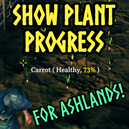

# Show Plant Progress
This Valheim mod shows a plant grow progress when you hover over it. It changes color depending on the progress. Super simple, that's it.

## Automatic Installation
R2ModMan: https://r2modman.com/

## Manual Installation
To install this mod, you need to have BepInEx: https://thunderstore.io/c/valheim/p/denikson/BepInExPack_Valheim/
After installing BepInEx, extract ShowPlantProgress.dll into games install **"\Valheim\BepInEx\plugins"**

## Config

### Global;
| Config Option | Type | Default Value | Description |
|:-------------:|:-----------:|:-----------:|:-----------|
| Enable Mod | bool | true | Enable or disable the mod |
| Enable Logging | bool | true | Enable or disable logging for this mod |

### Progress;
| Config Option | Type | Default Value | Description |
|:-----------:|:-----------:|:-----------:|:-----------|
| Show Percentage | bool | true | Shows the plant or pickable progress as a percentage when you hover over the plant or pickabe |
| Show Percentage Color | bool | true | Makes it so the percentage changes color depending on the progress |
| Show Percentage Decimal Places | int | 2 | The amount of decimal places to show for the percentage |
| Show Time | bool | false | Show the time when done |

If you have any suggestions, feel free to let me know!

## Not my code
This is just a new Visual Studio project around the code of https://github.com/smallo92/PlantGrowProgress and https://github.com/rikaakiba/PlantGrowProgress.
New project generated with bepinex5plugin template: https://docs.bepinex.dev/articles/dev_guide/plugin_tutorial/index.html
Just changed target from net46 to net462 (fixes missing reference to netstandard)

## Development setup
Installed VS2022 with:
Workloads:
- .NET desktop environment
Individual components:
- .NET Framework 8.0.x
